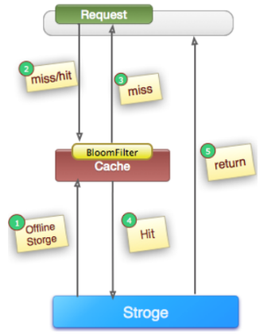

# 缓存穿透问题

缓存穿透在有些地方也称为“击穿”。很多朋友对缓存穿透的理解是：由于缓存故障或者缓存过期导致大量请求穿透到后端数据库服务器，从而对数据库造成巨大冲击。

这其实是一种误解。真正的缓存穿透应该是这样的：

在高并发场景下，如果某一个key被高并发访问，没有被命中，出于对容错性考虑，会尝试去从后端数据库中获取，从而导致了大量请求达到数据库，而当该key对应的数据本身就是空的情况下，这就导致数据库中并发的去执行了很多不必要的查询操作，从而导致巨大冲击和压力。

可以通过下面的几种常用方式来避免缓存传统问题：

1. 缓存空对象 对查询结果为空的对象也进行缓存，如果是集合，可以缓存一个空的集合（非null），如果是缓存单个对象，可以通过字段标识来区分。这样避免请求穿透到后端数据库。同时，也需要保证缓存数据的时效性。这种方式实现起来成本较低，比较适合命中不高，但可能被频繁更新的数据。
2. 单独过滤处理 对所有可能对应数据为空的key进行统一的存放，并在请求前做拦截，这样避免请求穿透到后端数据库。这种方式实现起来相对复杂，比较适合命中不高，但是更新不频繁的数据。

