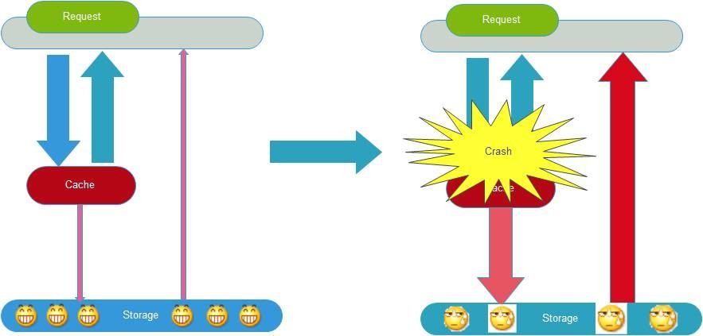

# 缓存的雪崩现象

缓存雪崩就是指由于缓存的原因，导致大量请求到达后端数据库，从而导致数据库崩溃，整个系统崩溃，发生灾难。导致这种现象的原因有很多种，上面提到的“缓存并发”，“缓存穿透”，“缓存颠簸”等问题，其实都可能会导致缓存雪崩现象发生。这些问题也可能会被恶意攻击者所利用。还有一种情况，例如某个时间点内，系统预加载的缓存周期性集中失效了，也可能会导致雪崩。为了避免这种周期性失效，可以通过设置不同的过期时间，来错开缓存过期，从而避免缓存集中失效。

从应用架构角度，我们可以通过限流、降级、熔断等手段来降低影响，也可以通过多级缓存来避免这种灾难。

此外，从整个研发体系流程的角度，应该加强压力测试，尽量模拟真实场景，尽早的暴露问题从而防范。

